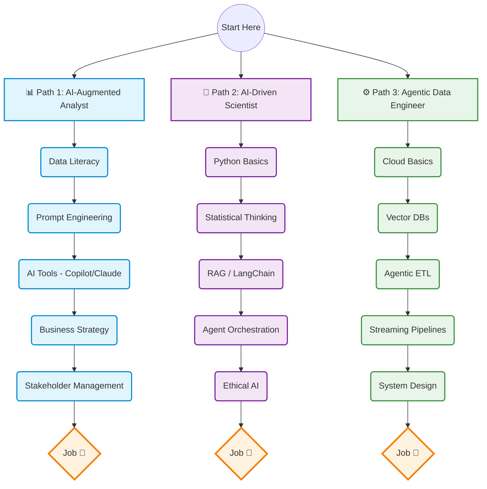

# 🇬🇷 Greek Data Science Roadmap 2026: The Agentic AI Era

> **Ο πλήρης οδηγός για την εποχή όπου τα εργαλεία αυτοματοποιούνται — Εστιάζοντας σε Critical Thinking, Domain Knowledge και AI Orchestration.**

Welcome to the **2026 Edition** of the Greek Data Science Roadmap. We are now deeply immersed in the Agentic AI era. Writing basic SQL queries or Pandas scripts is no longer the bottleneck; AI agents do that in seconds. The modern data professional in Greece (and globally) must pivot from *syntax memorizer* to *AI orchestrator*.

This guide outlines the new reality: **How to guide AI, not compete with it.**

---

## 🗺️ Roadmap Diagram (Agentic Era)

The traditional paths have evolved. Here is the visual representation of the modern AI-Augmented paths.

---

## 🛡️ What AI Cannot Replace

In an era where coding is commoditized, your human edge lies in areas AI struggles with:

1. **Domain Expertise:** AI knows the code, but *you* know the Greek Banking sector, the local Retail nuances, or Telecommunications logic. Context is king.
2. **Critical Thinking & Skepticism:** AI hallucinates. A great professional reviews, challenges, and validates AI outputs before trusting them.
3. **Problem Formulation:** AI can solve a well-defined problem, but defining *what problem to solve* to drive business value is a uniquely human skill.
4. **Stakeholder Management:** Navigating office politics, convincing C-level executives, and aligning teams around data initiatives.
5. **Ethics & Governance:** Deciding if it is *right* (or legal under GDPR) to use a specific dataset or algorithm.

---

## 🤝 How to Work WITH AI, not against it

- **Stop Memorizing Syntax:** Don't spend hours memorizing matplotlib parameters. Spend those hours learning *how to ask* an LLM to build the visualization, and learning *which* visualization actually tells the story.
- **Embrace "AI Orchestration":** Instead of writing a pipeline line-by-line, use frameworks (like LangChain) to have AI agents write, test, and deploy the pipeline while you architect the flow.
- **The "Reviewer" Mindset:** Treat AI like an extremely fast but sometimes careless Junior employee. Your job is now the Senior Reviewer.
- **Leverage AI for EDA:** Use Advanced Data Analysis (ChatGPT, Claude) to find hidden patterns instantly, saving you days of manual slicing and dicing.

---

## ⚡ The 5-Minute AI Audit

Μια γρήγορη checklist που κάθε Data Professional πρέπει να κάνει σε κάθε AI output:

- [ ] **Είναι τα δεδομένα που χρησιμοποίησε σωστά;** (Διπλοτσέκαρε τις πηγές και τους υπολογισμούς).
- [ ] **Υπάρχει hallucination;** (Μήπως το AI "έβγαλε" νούμερα από το μυαλό του;)
- [ ] **Ταιριάζει με το business context;** (Η λύση απαντάει όντως στο πρόβλημα της εταιρείας;)
- [ ] **Είναι GDPR compliant;** (Μήπως δώσαμε στο AI ευαίσθητα προσωπικά δεδομένα;)
- [ ] **Μπορώ να το εξηγήσω σε non-technical stakeholder;** (Αν όχι, το μοντέλο είναι απλώς ένα 'black box').

---

## 🧠 Essential Soft Skills for the Agentic Era

Καθώς τα hard skills (coding) αυτοματοποιούνται, τα soft skills γίνονται το κύριο ανταγωνιστικό πλεονέκτημα:

- 🗣️ **Data Storytelling & Επικοινωνία**: Η ικανότητα να μεταφράζεις πολύπλοκα αποτελέσματα (AI outputs) σε απλές, κατανοητές business προτάσεις.
- 🧩 **Adaptability (Προσαρμοστικότητα)**: Τα εργαλεία αλλάζουν κάθε 6 μήνες. Το skill είναι να μαθαίνεις πώς να μαθαίνεις νέα AI frameworks, όχι να δένεσαι με ένα.
- 🤝 **Stakeholder Management**: Να μπορείς να πείσεις τη διοίκηση να επενδύσει σε ένα AI project, διαχειριζόμενος σωστά τις προσδοκίες τους (χωρίς hype).
- 🤔 **Critical & First-Principles Thinking**: Να μην παίρνεις το output του LLM ως "ευαγγέλιο", αλλά να ελέγχεις τη λογική του βήμα-βήμα.
- 🛡️ **Ηθική & Ενσυναίσθηση**: Να κατανοείς τον αντίκτυπο που έχουν τα μοντέλα που φτιάχνεις στους τελικούς χρήστες (π.χ. αλγοριθμική μεροληψία, bias).

---

## 📈 Skills by Level (The 2026 Shift)

| Role / Level | Junior (0-2 years) | Mid-Level (2-5 years) | Senior (5+ years) |
| :--- | :--- | :--- | :--- |
| **AI-Augmented Analyst** | Prompt Engineering, Copilot usage, Data Literacy | Complex Prompting, AI output auditing, Business Strategy | AI Adoption Lead, Data Storytelling, Stakeholder alignment |
| **AI-Driven Scientist** | RAG basics, API integration, Statistical intuition | LangChain/CrewAI, Fine-tuning, Agent orchestration | AI Architecture, Ethical AI, AI ROI optimization |
| **Agentic Engineer** | Vector DBs, Cloud Basics, Copilot for code | Agentic ETL, Streaming AI pipelines, Data Governance | Enterprise AI Infrastructure, Security, System Design |

---

## 🇬🇷 Για την Ελληνική Κοινότητα (Greek Job Market 2026)

Η αγορά εργασίας έχει αλλάξει. Οι εταιρείες δεν ψάχνουν απλά "κάποιον να γράφει SQL". Ψάχνουν άτομα που μπορούν να χρησιμοποιήσουν AI για να φέρουν αποτελέσματα 10x πιο γρήγορα.

### Μέσοι Μισθοί & AI Premium (Εκτιμήσεις 2026)
Οι παρακάτω μισθοί είναι ρεαλιστικές εκτιμήσεις (projections) που περιλαμβάνουν το **"AI Premium"** (ένα bonus ~15-20% επειδή ο AI-Augmented επαγγελματίας παράγει πολλαπλάσιο όγκο δουλειάς) και τη δυναμική των **διεθνών Remote θέσεων** που είναι πλέον ο κανόνας.

- **AI-Augmented Analyst**: Mid ~1,600€-2,200€/μήνα (Net)
- **AI-Driven Scientist**: Mid ~2,200€-3,200€/μήνα (Net)
- **Agentic Engineer**: Mid ~2,500€-3,500€/μήνα (Net)

> 💡 **Σημείωση για την Τοπική Αγορά:** Αν αναφερόμαστε σε μια αυστηρά παραδοσιακή ελληνική επιχείρηση, χωρίς Remote χαρακτηριστικά και χωρίς το AI-Premium (δηλαδή κλασικούς ρόλους Data), οι καθαροί μισθοί συνήθως διαμορφώνονται περίπου **20% με 30% χαμηλότερα** (π.χ. 1,100€-1,400€ για Junior/Mid).

---

## ☕ A Day in the Life of a 2026 Data Professional (Στην Ελλάδα)

Πώς μοιάζει η καθημερινότητα τώρα που ο κώδικας αυτοματοποιείται;
- **09:00 - 09:30 | Daily Standup:** Δεν λες "έγραψα το SQL query". Λες "Έστησα το LangChain agent που διαβάζει τα logs και τώρα κάνω review τα αποτελέσματά του."
- **09:30 - 11:00 | Prompting & Orchestration:** Αντί να γράφεις boilerplate κώδικα, μιλάς με τον GitHub Copilot ή το Cursor. Ορίζεις τα schemas και ζητάς από το AI να φτιάξει τα dbt models.
- **11:00 - 13:00 | Model Auditing (Reviewer Mode):** Ελέγχεις τα insights που παρήγαγε το AI. Μήπως το μοντέλο είχε hallucination επειδή δεν κατάλαβε τα ελληνικά δεδομένα; (π.χ. μπέρδεψε τον "Νομό Αττικής" με τον "Δήμο Αθηναίων").
- **14:00 - 16:00 | Stakeholder Management:** Πηγαίνεις στα business departments (Marketing, Sales) και τους εξηγείς **γιατί** το μοντέλο προτείνει αυτή τη στρατηγική. *Το Data Storytelling είναι πλέον η κύρια δουλειά σου.*
- **16:00 - 17:00 | Continuous Learning:** Διαβάζεις τα latest research papers. Το tech stack αλλάζει κάθε 3 μήνες.

---

## 💡 "Greek-Flavored" Portfolio Projects
Θέλετε να ξεχωρίσετε στα interviews; Φτιάξτε projects που αφορούν την Ελλάδα. Αυτό δείχνει Business Acumen!
1. **Real Estate Analytics:** Κάντε web scraping σε αγγελίες ακινήτων (π.χ. Spitogatos) και φτιάξτε ένα Power BI Dashboard με τις τιμές ενοικίων ανά περιοχή.
2. **Sentiment Analysis σε Ελληνικά News/Twitter:** Χρησιμοποιήστε LangChain και το ChatGPT API για να αναλύσετε τι λένε οι Έλληνες για ένα τρέχον θέμα.
3. **Ανάλυση ΕΛΣΤΑΤ:** Χρησιμοποιήστε το [Greek-Data-Kit](https://github.com/karidasd/Greek-Data-Kit) για να αναλύσετε τον πληθωρισμό, την ανεργία ή τον τουρισμό και γράψτε ένα ωραίο Data Story στο LinkedIn.

---

## 🏢 Ελληνικά Communities & Meetups
Το networking είναι το 50% της επιτυχίας. Γίνετε μέλη σε αυτές τις κοινότητες:
- **Data Science Athens:** Το μεγαλύτερο meetup στην Αθήνα.
- **PyGreece:** Η κοινότητα της Python στην Ελλάδα.
- **Athens Big Data:** Εστιασμένο σε Data Engineering & Architecture.
- **Tech Talent School / Social Hackers Academy:** Για δωρεάν webinars και networking events.

---

## 📖 Λεξικό της Ελληνικής Tech Αγοράς (Jargon)
Τι θα ακούσετε στο γραφείο και τι πραγματικά σημαίνει:
- **"Έσκασε το pipeline στο prod"**: Κάτι χάλασε στον κώδικα που κατεβάζει/επεξεργάζεται τα δεδομένα και τα dashboards δείχνουν λάθος νούμερα.
- **"Κάνε ένα quick align με τον PM"**: Πήγαινε μίλα με τον Product Manager γιατί διαφωνείτε στο τι πρέπει να φτιαχτεί.
- **"Μην το κάνουμε over-engineer"**: Μην γράφεις 500 γραμμές κώδικα (ή Deep Learning) για κάτι που λύνεται με ένα απλό `GROUP BY`.
- **"Ποιο είναι το Business value;"**: Αν αυτό που φτιάχνεις δεν φέρνει έσοδα ή δεν γλιτώνει χρόνο, δεν πρέπει να το φτιάξουμε.
- **"Έχουμε πολλά Silos"**: Το τμήμα Πωλήσεων δεν μιλάει με το τμήμα Marketing, τα δεδομένα τους είναι σε διαφορετικές βάσεις (silos), και εμείς πρέπει να τα ενώσουμε (Nightmare).
- **"Πρέπει να πάρουμε Stakeholder buy-in"**: Πρέπει να πείσουμε τον Director/VP ότι η AI ιδέα μας αξίζει, αλλιώς δεν θα μας δώσουν budget/χρόνο.
- **"Legacy Systems"**: Συστήματα (συνήθως τραπεζικά ή τηλεπικοινωνιών) φτιαγμένα πριν από 20 χρόνια που κανείς δεν τολμάει να αγγίξει, αλλά εσύ πρέπει να πάρεις δεδομένα από εκεί.
- **"Churn"**: Όταν ο πελάτης μας εγκαταλείπει (π.χ. φεύγει από τη Vodafone για την Cosmote). Το Άγιο Δισκοπότηρο της ανάλυσης δεδομένων είναι να προβλέψουμε το Churn πριν συμβεί.

---

## 🧰 The "Day 1" Starter Kit
Δείτε τον φάκελο [`templates/`](templates/) για να βρείτε:
- Ένα [Data Science CV Template](templates/data_science_cv_template.md) βελτιστοποιημένο για ATS.
- Το **Project Boilerplate**: Πώς στήνεται σωστά ένα Data project (με `requirements.txt`, `Dockerfile` κλπ).

---

## 🤖 AI CV Reviewer Script
Δοκιμάστε το Python script μας [`tools/cv_reviewer_agent.py`](tools/cv_reviewer_agent.py). Λειτουργεί σαν ένας αυστηρός Έλληνας Hiring Manager! Δώστε του το βιογραφικό σας και θα σας κάνει review με χρήση AI (απαιτεί OpenAI API Key).

---

## 🏛️ Ελληνικά Open Data Sources
Διαβάστε το [GREEK_DATASETS.md](GREEK_DATASETS.md) για να βρείτε πηγές δεδομένων (ΕΛΣΤΑΤ, Διαύγεια, data.gov.gr) ώστε να χτίσετε μοναδικά projects.

---

## 🤖 Mock Interview Simulator Prompts
Στο αρχείο [PROMPTS.md](PROMPTS.md) θα βρείτε έτοιμα System Prompts. Κάντε τα copy-paste στο ChatGPT/Claude για να εξασκηθείτε σε τεχνικές συνεντεύξεις.

---

## 📓 RAG Demo Notebook
Ανοίξτε το [`notebooks/agentic_demo.ipynb`](notebooks/agentic_demo.ipynb) για να δείτε πώς στήνουμε ένα LangChain workflow (Agentic AI) με λίγες γραμμές Python. 

---

## 🛠️ No-Code & Automation
Διαβάστε το [NO_CODE.md](NO_CODE.md) για να μάθετε ποια εργαλεία (n8n, Make, Zapier) είναι απαραίτητα για AI Orchestration χωρίς κώδικα.

---

## 🏢 Real Greek Business Cases
Διαβάστε το [SCENARIOS.md](SCENARIOS.md) για να δείτε 3 πραγματικά σενάρια που αντιμετωπίζουν οι Έλληνες Data Professionals (Τράπεζες, NPLs, E-commerce) και πώς πρέπει να τα σκεφτείτε.

---

## 🎤 Technical Interviews
Διαβάστε το [INTERVIEWS.md](INTERVIEWS.md) για να δείτε τι ακριβώς ρωτάνε οι ελληνικές εταιρείες στα technical assessments (HackerRank, Take-home projects).

---

## 🤝 Contributing

Αν δεν έχετε ξανακάνει ποτέ Open Source contribution, διαβάστε τον οδηγό **["My First PR" (FIRST_PR.md)](FIRST_PR.md)**! Σας παίρνουμε από το χέρι για να κάνετε το πρώτο σας βήμα στο GitHub.

Θέλετε να προσθέσετε νέα resources για Agentic AI, Vector Databases ή Prompt Engineering;
Διαβάστε το [CONTRIBUTING.md](CONTRIBUTING.md) για να δείτε πώς μπορείτε να συνεισφέρετε!

---

Made with ❤️ by <b>Karydas Dimitris</b>
 
<i>"Empowering the next generation of data professionals for the Agentic Era."</i>

